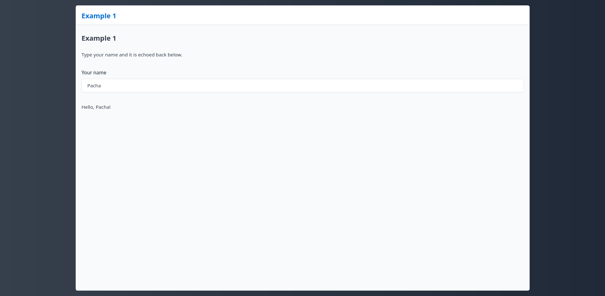
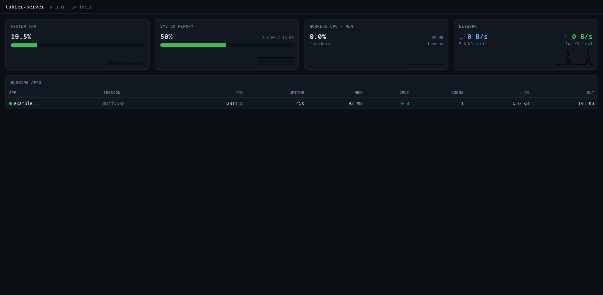

# tabler-server

[](https://www.buymeacoffee.com/pacha)

## About

A **minimal**, Linux-only server for hosting [`tabler`](https://github.com/pachadotdev/tabler)
R applications - the tabler equivalent of Shiny Server, but deliberately tiny.

It is a small C++ reverse proxy + process supervisor. It does **one** thing:

- serves every app found under an apps directory (default `/srv/tabler-server/apps`)
  at a matching URL path, and
- gives every browser session its own private R worker process that is reaped
  after inactivity.

Everything else (TLS, gzip, auth, rate limiting, HTTP/2, ...) is intentionally
**out of scope** and is meant to be handled by a front proxy such as **nginx**
+ **Let's Encrypt** in front of tabler-server.

```
            +------------------- Linux host ----------------------+
Internet -> | nginx (TLS, :443) -> tabler-server (C++, :3000)     |
            |                       |                             |
            |                       |- R worker (app1, session A) |
            |                       |- R worker (app1, session B) |
            |                       |- R worker (app2, session C) |
            +-----------------------------------------------------+
```

## Concept

1. **Make based - plain C++17, no heavy dependencies**
2. **C++ does the proxying/supervision**
3. **R runs the apps**
4. **No Python support**
5. **Linux only - managed with `systemctl`**

## How apps are served

Copy each app into its own directory under the apps directory:

```
/srv/tabler-server/apps/
|- example1/
|   |- app.R
|- example2/
|   |- app.R
```

They become available at:

```
http://localhost:3000/example1
http://localhost:3000/example2
```

Visiting `http://localhost:3000/` lists the available apps.

Visiting `http://localhost:3001/` shows the admin panel.

<figure>

</figure>

<figure>

</figure>

### App layout

Each app is a directory containing an `app.R`. `tablerApp(ui, server)` is not
needed to run apps with tabler-server, it is only required to run an app from
a local R session.

```r
# Define `ui` and `server`; no tablerApp() call needed.
library(tabler)
ui <- page(...)
server <- function(input, output, session) { ... }
```

You do **not** choose the port in the app. tabler-server assigns a private
loopback port to each worker.

Using `tablerApp()` in the script to run an app via tabler-server will result
in log errors related to `tablerApp()` using the default port 3000.

## Examples

`tabler` provides multiple examples [here](https://github.com/pachadotdev/tabler/tree/main/examples).

## Sessions

- **One R worker per browser session.** A session is created the first time a
  browser loads an app page and is tracked with a `tabler_sid` cookie.
- **Reload = fresh session.** Reloading the page mints a new session and worker;
  the old worker becomes idle and is reaped.
- **Idle reaping.** A worker with no active WebSocket connection is killed after
  `disconnect_grace` seconds (default 15s, covers a closed tab). Any worker is
  killed after `idle_timeout` seconds of inactivity (default 300s = 5 min).

## Per-tab isolation behaviour

Cookies are shared across tabs of the same browser, so two tabs of the *same*
app currently share one worker/session. The proxy is structured so true per-tab
isolation can be added later with a one-line change to `tabler-reactive.js`
(append a `sessionStorage` token to the `/ws` URL). See
[docs/DESIGN.md](docs/DESIGN.md).

## Requirements

- Linux, `g++` (C++17) or `clang++`, `make`.
- `R` with the `tabler` package installed **system-wide** (so workers can
  `library(tabler)`).

## Install

```bash
chmod +x ./scripts/install.sh 
sudo ./scripts/install.sh
sudo systemctl enable --now tabler-server
sudo systemctl status tabler-server
```

## Development

```bash
make -j4
```

The binaries target is `build/tabler-server`.

To run in development mode:

```bash
./build/tabler-server --config config/tabler-server.conf
```

## Adding apps

Copy apps into `/srv/tabler-server/apps/<name>/app.R`.

## TLS with nginx + Let's Encrypt

tabler-server speaks plain HTTP on `127.0.0.1:3000`. Put nginx in front:

```bash
sudo cp config/nginx/tabler-server.conf /etc/nginx/sites-available/tabler-server
sudo ln -s /etc/nginx/sites-available/tabler-server /etc/nginx/sites-enabled/
sudo certbot --nginx -d apps.example.com
sudo systemctl reload nginx
```

The provided nginx config already forwards WebSocket upgrade headers, which the
tabler reactive bridge needs.

If you want to link one app to one domain instead all listing all apps from
my.site, you need something like this:

```nginx
server {
    server_name my.site www.my.site;

    access_log /var/log/nginx/mysite.access.log;
    error_log /var/log/nginx/mysite.error.log;

    # 1. Bare domain root -> triggers a page load for the "myapp" app.
    # tabler-server mints a fresh session here and returns the app HTML, which
    # itself references assets with ROOT-relative paths (e.g. ./js/, ./css,
    # etc.), not /myapp/js/ - so no rewrite/redirect tricks are needed.
    location = / {
        proxy_pass http://127.0.0.1:3000/myapp;
        proxy_set_header Host $host;
        proxy_set_header X-Real-IP $remote_addr;
        proxy_set_header X-Forwarded-For $proxy_add_x_forwarded_for;
        proxy_set_header X-Forwarded-Proto $scheme;
    }

    # 2. Everything else (e.g., CSS assets): forward UNCHANGED. tabler-server
    # routes these purely by the tabler_sid cookie (Set-Cookie Path=/), not by
    # URL prefix - do NOT rewrite or prepend /myapp here.
    location / {
        proxy_pass http://127.0.0.1:3000;
        proxy_redirect off;

        proxy_set_header Host $host;
        proxy_set_header X-Real-IP $remote_addr;
        proxy_set_header X-Forwarded-For $proxy_add_x_forwarded_for;
        proxy_set_header X-Forwarded-Proto $scheme;

        # WebSocket support (Mandatory for tabler's reactive bridge)
        proxy_http_version 1.1;
        proxy_set_header Upgrade $http_upgrade;
        proxy_set_header Connection "upgrade";
        proxy_read_timeout 20d;
        proxy_buffering off;
    }

    listen 443 ssl; # managed by Certbot
    ssl_certificate /etc/letsencrypt/live/my.site/fullchain.pem; # managed by Certbot
    ssl_certificate_key /etc/letsencrypt/live/my.site/privkey.pem; # managed by Certbot
    include /etc/letsencrypt/options-ssl-nginx.conf; # managed by Certbot
    ssl_dhparam /etc/letsencrypt/ssl-dhparams.pem; # managed by Certbot
}

server {
    if ($host = www.my.site) {
      return 301 https://$host$request_uri;
    } # managed by Certbot

    if ($host = my.site) {
      return 301 https://$host$request_uri;
    } # managed by Certbot

    server_name my.site www.my.site;
    listen 80;
    return 404; # managed by Certbot
}
```

## Configuration

See [config/tabler-server.conf](config/tabler-server.conf). Key = value, one per
line, `#` for comments.

| Key                 | Default                     | Meaning                                        |
| ------------------- | --------------------------- | ---------------------------------------------- |
| `listen`            | `127.0.0.1`                 | Bind address                                   |
| `port`              | `3000`                      | Bind port                                      |
| `apps_dir`          | `/srv/tabler-server/apps`   | Where app directories live                     |
| `rscript`           | `Rscript`                   | Rscript executable used to launch workers      |
| `worker_script`     | `share/worker.R`            | R bootstrap that launches a tabler app         |
| `run_as`            | *(unset)*                   | Drop privileges to this user for workers       |
| `worker_port_base`  | `34000`                     | First loopback port handed to workers          |
| `worker_port_count` | `256`                       | Size of the worker port range                  |
| `idle_timeout`      | `300`                       | Kill a worker after N seconds idle             |
| `disconnect_grace`  | `15`                        | Kill a worker N seconds after its WS closes    |
| `worker_start_timeout` | `20`                     | Seconds to wait for a worker to accept traffic |
| `log_dir`           | `/var/log/tabler-server`    | Worker stderr logs                             |

## Differences with Shiny Server

Shiny Server Open Source lacks enterprise features like built-in user authentication, role-based access control, and automated scaling for heavy traffic. It can be expanded by using Shiny Server Pro (discontinued) or [Posit Connect](). However, its open source edition uses the AGPL software license, which makes it unsuitable for commercial applications.

Tabler Server, and the tabler R package, allow to create interactive dashboard with a similar syntax to Shiny apps in R and both are released under the Apache License. This means that Tabler Server is not a commercial product, it can be used for a wide range of projects including commercial uses, and it is released "as is".

The Apache License 2.0 permits commercial use, modification, distribution, and private use, while prohibiting holding authors liable and the unauthorized use of trademarks. It requires including the original copyright, patent notices, and license text in any distribution. See more on [tl;drLegal](https://www.tldrlegal.com/license/apache-license-2-0-apache-2-0).

Besides uses, Tabler Server allows multi-session and lets you open the same app independently from different tabs, browsers or machines.

## Contributing

This project can largely improve with more people helping to improve it. R and Linux are the result
of many coordinated actors with no central authority.

If this project gets attention, I have the following values in mind:

* **Public Commons**: No single organization dictates how people use, modify, or distribute the software.
* **Individual Freedom**: Users have total control over their own systems and code.
* **Community Based**: Suggestions to improve the framework are as values as improvements to the code and functionality.

See the [Code of conduct](https://github.com/pachadotdev/tabler-server/blob/main/.github/CODE_OF_CONDUCT.md).

## License

Apache-2.0 (matching the `tabler` R package).
